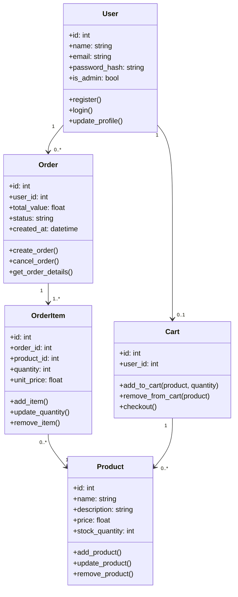

## UML Diagram




```mermaid
usecaseDiagram
actor "Usuário" as User
actor "Vendedor" as Seller
actor "Gerente" as Manager
actor "Dono" as Owner
actor "Administrador" as Admin
actor "Sistema" as System

User --> (Cadastrar cliente)
User --> (Consultar dados cadastrais)
User --> (Atualizar dados cadastrais)
User --> (Excluir cliente)

User --> (Cadastrar medicamento)
User --> (Consultar medicamentos)
User --> (Atualizar medicamento)
User --> (Excluir medicamento)
User --> (Cadastrar medicamento com tarja)
User --> (Registrar venda)
User --> (Aplicar descontos automáticos)
User --> (Receber alerta de baixo estoque)
User --> (Verificar validade de medicamentos)
User --> (Registrar formas de pagamento)
User --> (Emitir nota fiscal)
User --> (Gerar relatório de vendas)
User --> (Gerar relatório de estoque)
User --> (Registrar venda de controlados com receita)
User --> (Validar quantidade máxima de controlados)
User --> (Gerar relatório de medicamentos controlados)

Admin --> (Definir papéis e permissões)

Seller --> (Registrar vendas)

Manager --> (Gerenciar estoque)
Manager --> (Aprovar descontos especiais)

Owner --> (Acessar relatórios financeiros)
Owner --> (Alterar permissões)

System --> (Bloquear ações sem permissão)
```
