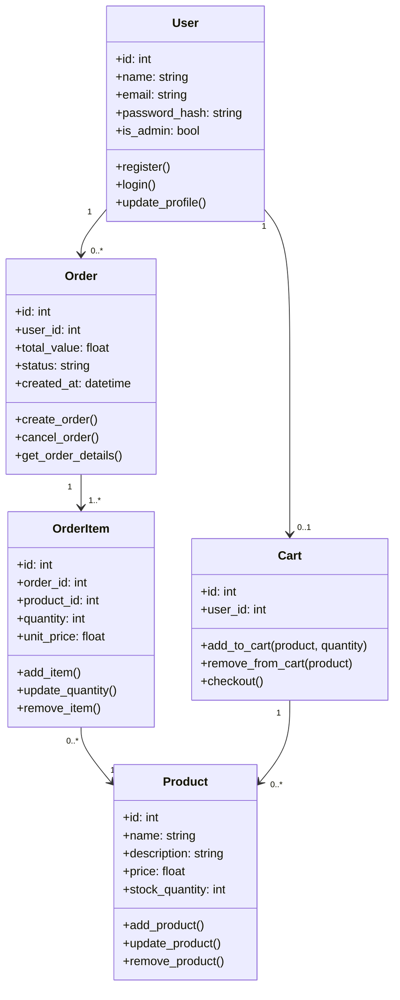

## UML Diagram

```mermaid
classDiagram
    User "1" --> "0..*" Order
    Order "1" --> "1..*" OrderItem
    OrderItem "0..*" --> "1" Product
    User "1" --> "0..1" Cart
    Cart "1" --> "0..*" Product

    class User {
      +id: int
      +name: string
      +email: string
      +password_hash: string
      +is_admin: bool
      +register()
      +login()
      +update_profile()
    }

    class Product {
      +id: int
      +name: string
      +description: string
      +price: float
      +stock_quantity: int
      +add_product()
      +update_product()
      +remove_product()
    }

    class Order {
      +id: int
      +user_id: int
      +total_value: float
      +status: string
      +created_at: datetime
      +create_order()
      +cancel_order()
      +get_order_details()
    }

    class OrderItem {
      +id: int
      +order_id: int
      +product_id: int
      +quantity: int
      +unit_price: float
      +add_item()
      +update_quantity()
      +remove_item()
    }

    class Cart {
      +id: int
      +user_id: int
      +add_to_cart(product, quantity)
      +remove_from_cart(product)
      +checkout()
    }
```
