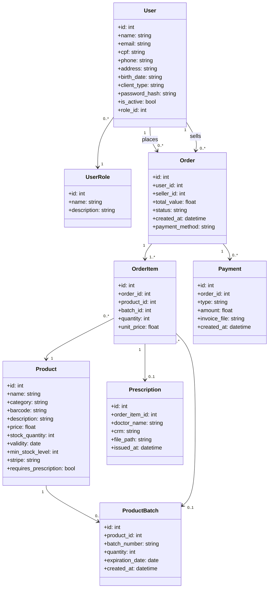

## UML Diagram

```mermaid
classDiagram
    class User {
      +id: int
      +name: string
      +email: string
      +cpf: string
      +phone: string
      +address: string
      +birth_date: string
      +client_type: string
      +password_hash: string
      +is_active: bool
      +role_id: int
    }
    
    class UserRole {
      +id: int
      +name: string
      +description: string
    }

    class Product {
      +id: int
      +name: string
      +category: string
      +barcode: string
      +description: string
      +price: float
      +stock_quantity: int
      +validity: date
      +min_stock_level: int
      +stripe: string
      +requires_prescription: bool
    }

    class ProductBatch {
      +id: int
      +product_id: int
      +batch_number: string
      +quantity: int
      +expiration_date: date
      +created_at: datetime
    }

    class Order {
      +id: int
      +user_id: int
      +seller_id: int
      +total_value: float
      +status: string
      +created_at: datetime
      +payment_method: string
    }

    class OrderItem {
      +id: int
      +order_id: int
      +product_id: int
      +batch_id: int
      +quantity: int
      +unit_price: float
    }

    class Payment {
      +id: int
      +order_id: int
      +type: string
      +amount: float
      +invoice_file: string
      +created_at: datetime
    }

    class Prescription {
      +id: int
      +order_item_id: int
      +doctor_name: string
      +crm: string
      +file_path: string
      +issued_at: datetime
    }

    User "1" --> "0..*" Order : places
    User "1" --> "0..*" Order : sells
    User "0..*" --> "1" UserRole
    Product "1" --> "0..*" ProductBatch
    Order "1" --> "1..*" OrderItem
    Order "1" --> "0..*" Payment
    OrderItem "0..*" --> "1" Product
    OrderItem "0..*" --> "0..1" ProductBatch
    OrderItem "1" --> "0..1" Prescription
```

## Entity Relation Diagram (Final DDL)

