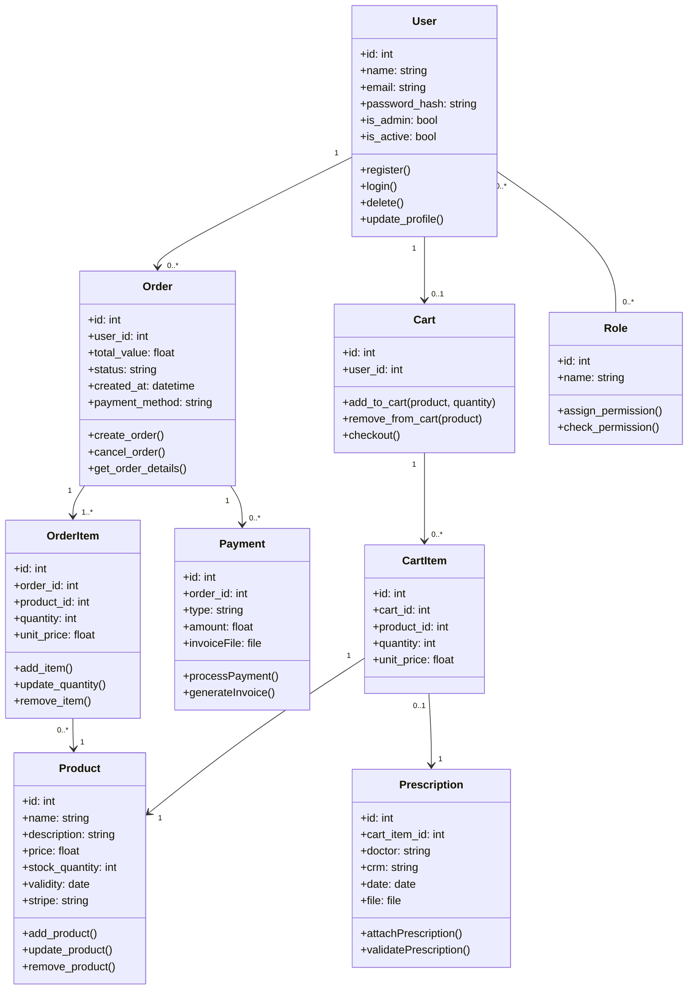

## UML Diagram

```mermaid
classDiagram
    class User {
      +id: int
      +name: string
      +email: string
      +password_hash: string
      +is_admin: bool
      +is_active: bool
      +register()
      +login()
      +delete()
      +update_profile()
    }
    
    class Role {
      +id: int
      +name: string
      +assign_permission()
      +check_permission()
    }

    class Product {
      +id: int
      +name: string
      +description: string
      +price: float
      +stock_quantity: int
      +validity: date
      +stripe: string
      +add_product()
      +update_product()
      +remove_product()
    }

    class Order {
      +id: int
      +user_id: int
      +total_value: float
      +status: string
      +created_at: datetime
      +payment_method: string
      +create_order()
      +cancel_order()
      +get_order_details()
    }

    class OrderItem {
      +id: int
      +order_id: int
      +product_id: int
      +quantity: int
      +unit_price: float
      +add_item()
      +update_quantity()
      +remove_item()
    }

    class Cart {
      +id: int
      +user_id: int
      +add_to_cart(product, quantity)
      +remove_from_cart(product)
      +checkout()
    }

    class CartItem {
      +id: int
      +cart_id: int
      +product_id: int
      +quantity: int
      +unit_price: float
    }

    class Payment {
      +id: int
      +order_id: int
      +type: string
      +amount: float
      +invoiceFile: file
      +processPayment()
      +generateInvoice()
    }

    class Prescription {
      +id: int
      +cart_item_id: int
      +doctor: string
      +crm: string
      +date: date
      +file: file
      +attachPrescription()
      +validatePrescription()
    }

    User "1" --> "0..*" Order
    User "1" --> "0..1" Cart
    User "0..*" -- "0..*" Role
    Order "1" --> "1..*" OrderItem
    Order "1" --> "0..*" Payment
    OrderItem "0..*" --> "1" Product
    Cart "1" --> "0..*" CartItem
    CartItem "1" --> "1" Product
    CartItem "0..1" --> "1" Prescription
```

